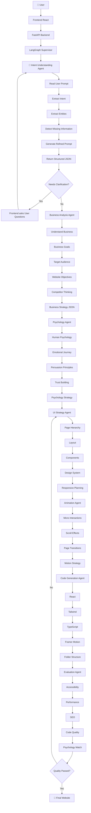

```mermaid
flowchart TD

    A[👤 User]

    A --> B[Frontend React]

    B --> C[FastAPI Backend]

    C --> D[LangGraph Supervisor]

    %% --------------------------
    %% Intent Agent
    %% --------------------------

    D --> E["🧠 Intent Understanding Agent"]

    E --> E1[Read User Prompt]

    E1 --> E2[Extract Intent]

    E2 --> E3[Extract Entities]

    E3 --> E4[Detect Missing Information]

    E4 --> E5[Generate Refined Prompt]

    E5 --> E6[Return Structured JSON]

    E6 --> F{Needs Clarification?}

    F -->|Yes| G[Frontend asks User Questions]

    G --> E

    F -->|No| H[Business Analysis Agent]

    %% --------------------------
    %% Business Agent
    %% --------------------------

    H --> H1[Understand Business]

    H1 --> H2[Business Goals]

    H2 --> H3[Target Audience]

    H3 --> H4[Website Objectives]

    H4 --> H5[Competitor Thinking]

    H5 --> H6[Business Strategy JSON]

    H6 --> I[Psychology Agent]

    %% --------------------------
    %% Psychology Agent
    %% --------------------------

    I --> I1[Human Psychology]

    I1 --> I2[Emotional Journey]

    I2 --> I3[Persuasion Principles]

    I3 --> I4[Trust Building]

    I4 --> I5[Psychology Strategy]

    I5 --> J[UI Strategy Agent]

    %% --------------------------
    %% UI Agent
    %% --------------------------

    J --> J1[Page Hierarchy]

    J1 --> J2[Layout]

    J2 --> J3[Components]

    J3 --> J4[Design System]

    J4 --> J5[Responsive Planning]

    J5 --> K[Animation Agent]

    %% --------------------------
    %% Animation Agent
    %% --------------------------

    K --> K1[Micro Interactions]

    K1 --> K2[Scroll Effects]

    K2 --> K3[Page Transitions]

    K3 --> K4[Motion Strategy]

    K4 --> L[Code Generation Agent]

    %% --------------------------
    %% Code Agent
    %% --------------------------

    L --> L1[React]

    L1 --> L2[Tailwind]

    L2 --> L3[TypeScript]

    L3 --> L4[Framer Motion]

    L4 --> L5[Folder Structure]

    L5 --> M[Evaluation Agent]

    %% --------------------------
    %% Evaluation Agent
    %% --------------------------

    M --> M1[Accessibility]

    M1 --> M2[Performance]

    M2 --> M3[SEO]

    M3 --> M4[Code Quality]

    M4 --> M5[Psychology Match]

    M5 --> N{Quality Passed?}

    N -->|No| J

    N -->|Yes| O[🚀 Final Website]
```
